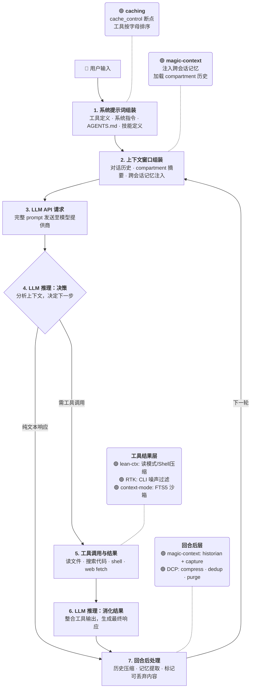
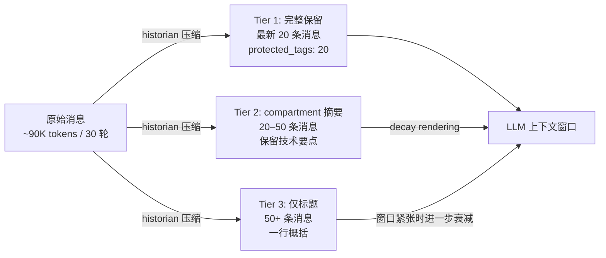
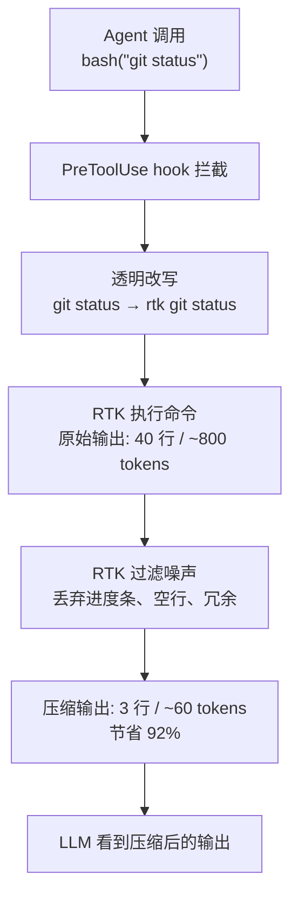
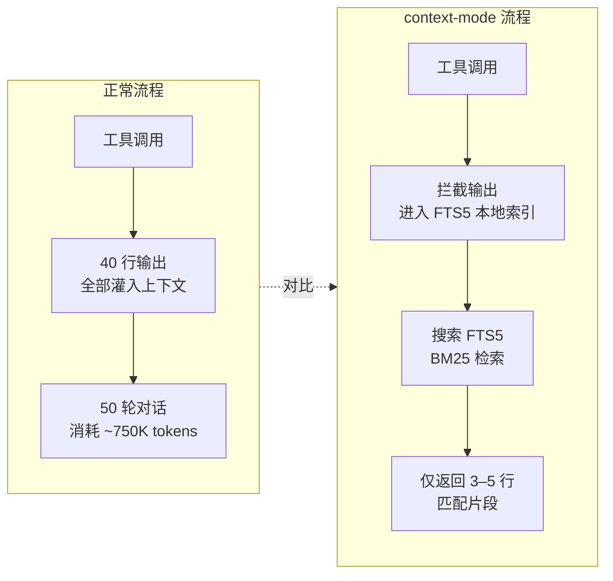
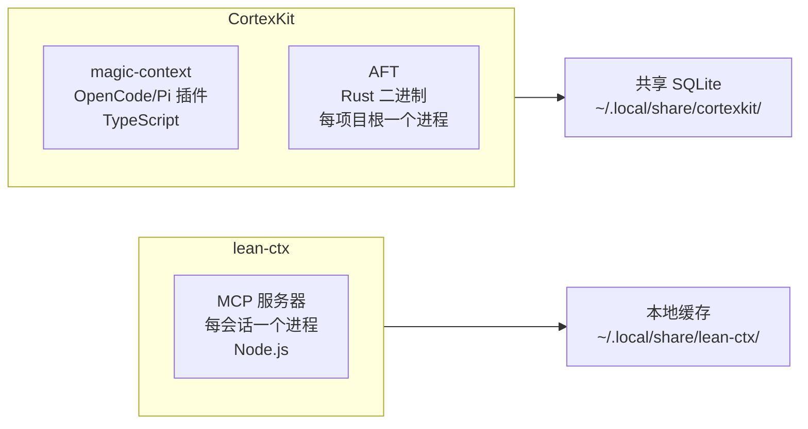
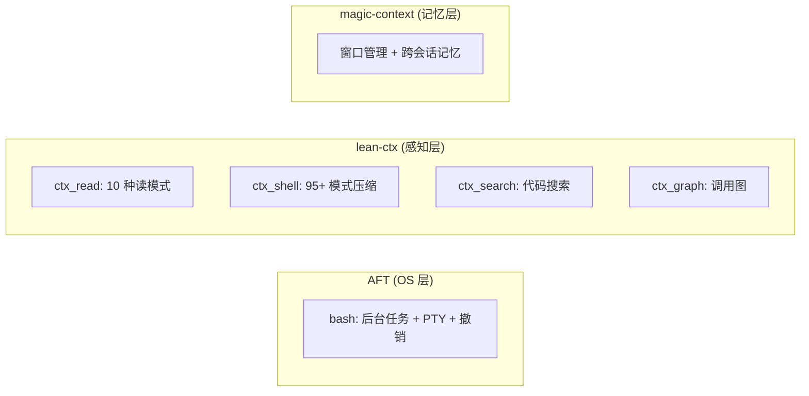

# Token 节约工具分析

---

## 一、Agent 回合生命周期

一次完整的 agent 对话回合经过 7 个阶段：



- **阶段 4 和 6** 是同一次 LLM 推理过程，拆分为两段仅为了区分"决策阶段"和"消化工具结果阶段"
- **阶段 5** 是工具密集度最高的阶段：lean-ctx、RTK、context-mode 均在此介入
- **虚线** (`-..-`) 表示工具与对应阶段的关联关系，非流程跳转

---

## 二、各工具介入位置

| 阶段                       | OpenCode 实现                       | Pi 实现                       | 作用                                                              |
| -------------------------- | ----------------------------------- | ----------------------------- | ----------------------------------------------------------------- |
| 1+3+7. 提示词+API+回合后   | `oc-plugin-caching`                 | `pi-cache-optimizer`          | 主动：插入 cache_control 断点，稳定前缀                           |
|                            |                                     |                               | 被动：命中率遥测 + 前缀守卫 + 缓存友好压缩                        |
| 2. 窗口组装                | `@cortexkit/opencode-magic-context` | `@cortexkit/pi-magic-context` | 管理 compartment 历史 + 注入跨会话记忆                            |
| 5. 工具结果                | `lean-ctx` MCP 服务器               | `pi-lean-ctx`                 | 10 种读模式 + shell 输出压缩 + 缓存重读                           |
| 5. 工具结果                | `@rtk/opencode-plugin`              | `pi-rtk-optimizer`            | CLI 命令噪声过滤（PreToolUse hook 透明改写）                      |
| 2+7. 窗口+回合后           | `@tarquinen/opencode-dcp`           | `pi-dynamic-context-pruning`  | 模型触发式压缩 + 工具去重 + 错误清理                              |
| 5. 工具结果                | `context-mode` MCP 插件 (mksglu)    | —                             | 工具输出沙箱 → FTS5 索引 → BM25 搜索                              |
| 输出层                     | caveman 技能                        | `@vanillagreen/pi-caveman`    | 输出风格压缩，~75% 输出 token 削减                                |

**阶段 5（工具结果）有 4 个工具同时介入**：lean-ctx、RTK、context-mode 均在此阶段工作。它们互不冲突——lean-ctx 通过 MCP 工具前缀 `lean-ctx_ctx_*` 工作，RTK 通过 opencode 插件 hook 透明改写 bash 命令，context-mode 通过 MCP 服务器的 5 个生命周期钩子拦截。实际上你的会话中 lean-ctx 和 RTK 已同时运行。

`oc-plugin-caching` / `pi-cache-optimizer` 横跨阶段 1（提示词组装时插入 cache_control 断点）、阶段 3（API 请求层，监控 `message_end` 事件累加缓存统计、检测前缀变化）和阶段 7（回合后，接管 `session_before_compact` 实现确定性压缩）。

---

## 三、实例演示：一次 Bug 修复会话

以下用一次典型编码会话，说明各工具在每个阶段的实际作用。

**场景**：用户要求 agent 定位认证模块的逻辑并修复一个 token 过期判断的 off-by-one 错误。模型为 `claude-sonnet-4-20250514`（200K context limit）。

---

### 阶段 1 – 系统提示词组装

agent 启动，opencode 构建 prompt：

```
[caching 介入]
  系统指令 + 工具定义 schema 约 8,000 tokens
  → oc-plugin-caching 在工具定义末尾插入 cache_control 断点
  → 工具名称按字母排序：bash, edit, glob, grep, read, task, todowrite, write
  → Provider（Anthropic）在第一次请求后缓存此前缀

[magic-context 介入]
  从 context.db 中检索本项目的跨会话记忆：
  - "认证模块位于 src/auth/，入口文件 authenticator.ts"
  - "token 过期逻辑在 verifyToken() 函数中"
  → 注入到 AGENTS.md 之后、对话历史之前
  → 额外消耗 ~150 tokens，但省去了 agent 搜索项目结构的时间

[RTK / context-mode 此阶段不工作]
```

agent 实际看到的 prompt 开头约 8,150 tokens（系统 + 记忆），后续 29 轮请求中这 8,000 tokens 的前缀部分（含工具定义）均命中缓存，免计费。

---

### 阶段 2–3 – 首次推理与工具调用

agent 决定先用 grep 搜索 `authenticate` 定位代码：

```
[无工具介入，正常 API 调用]
  agent 发送 prompt → 模型推理 → 决定调用 grep
```

---

### 阶段 5 – 工具执行与结果返回

**搜索代码**：

```
[RTK 介入]
  agent 调用 bash("grep -rn authenticate src/")
  → PreToolUse hook 拦截，透明改写为：rtk grep -rn authenticate src/
  → 原始输出 120 行（含大量 node_modules 误匹配，~2,400 tokens）
  → RTK 过滤：去 node_modules，去空白行，去重复 → 22 行（~440 tokens）
  → 节省 81.7%（RTK 实测 grep 平均节省 49.5%，有 node_modules 时更高）


[若用 lean-ctx 替代原生 grep]
  agent 调用 ctx_search(pattern="authenticate", include="*.ts")
  → lean-ctx 仅返回匹配行 + 文件名，去噪率类似
```

**读取文件**：

```
[lean-ctx 介入]
  agent 调用 lean-ctx_ctx_read(path="src/auth/authenticator.ts", mode="signatures")
  → 原始文件 350 行（~7,000 tokens）
  → signatures 模式仅返回类型/函数签名：35 行（~700 tokens）
  → 节省 90%

  agent 看到 verifyToken(expiry: number): boolean 并定位目标函数后，
  再用 full 模式读该函数所在区域：
  lean-ctx_ctx_read(path="src/auth/authenticator.ts", mode="lines:120-145")
  → 25 行，恰好够理解逻辑

  [若用 context-mode 替代]
    搜索 authenticate → 输出进入 FTS5 沙箱
    → agent 通过 BM25 搜索 "verifyToken expiry" → 仅返回匹配的 5 行片段
```

**运行测试**：

```
[RTK 介入]
  agent 调用 bash("cargo test auth::")
  → RTK 过滤：原始输出 180 行（~3,600 tokens）
  → 保留测试结果 + 失败详情，丢弃编译进度条和空行 → 12 行（~240 tokens）
  → 节省 93.3%（RTK 实测 cargo test 平均节省 91.8%）
```

---

### 阶段 6 – 消化结果，做出修改

agent 理解了代码逻辑，发现问题在 `verifyToken()` 中用 `expiry < now` 应该是 `expiry <= now`：

```
[magic-context — ctx_reduce]
  agent 标记前面 grep 和 cargo test 的大输出为可丢弃：
  ctx_reduce(drop="5-6")  ← 这两个 §N§ 标签的内容已处理完毕
  → 进入队列，等待 cache-safe 时刻释放
```

agent 调用 edit 修改代码，然后再次运行测试确认修复。

---

### 阶段 7 – 回合后处理（多轮后触发）

经过 20 轮调试、测试、修改，会话历史已增长到 ~85,000 tokens（超过 magic-context 的 `execute_threshold_percentage` 65% ≈ 130K 的 65% → 实际上 85K/200K=42.5% 还未触发）。假设继续到 50 轮后触发：

```
[magic-context — Historian 压缩]
  窗口使用率达 68%（136K of 200K）
  → historian（用 deepseek-v4-flash 运行）在后台将第 1–30 轮压缩
  → 30 轮原始消息 ~90K tokens → 3 个 compartment 摘要 ~8K tokens
  → 节省 ~82K tokens，窗口使用率回到 27%

  compartment 内容示例：
  <compartment start="1" end="10" title="定位认证模块">
    agent 搜索 authenticate 定位到 src/auth/authenticator.ts，
    阅读 verifyToken() 签名，确认 token 过期逻辑入口，开始分析 off-by-one
  </compartment>

  [decay rendering 介入]
  后续窗口压力更大时，此 compartment 从段落级摘要衰减为单句：
  "认证模块位于 src/auth/authenticator.ts，已理解 verifyToken() 逻辑"


[magic-context — Capture 记忆提取]
  同一趟压缩中，historian 提取以下记忆到 context.db：
  - "认证模块位于 src/auth/，入口 authenticator.ts" (ARCHITECTURE)
  - "verifyToken 函数在 authenticator.ts:120-145" (CONFIG_VALUES)
  → 下次会话启动时自动注入


[DCP 介入 — 如果启用]
  模型发送 compress 请求（非阈值触发，而是 agent 判断任务阶段已结束）
  → range 模式：第 15–25 轮（重复的测试-修改-测试循环）被压缩为：
    "15-25 轮：调试 off-by-one 修复。逐个调整 expiry 比较，每轮运行 cargo test auth::
     确认。最终修改：expiry < now → expiry <= now (authenticator.ts:128)"
  → 去重：3 次相同参数的 cargo test auth:: 调用，保留最后一次结果
  → 原始 35K tokens → 摘要 1.2K tokens


[magic-context — Dreamer 夜间运行]
  第二天 03:00，dreamer 自动：
  - 将 "verifyToken 在 authenticator.ts:120-145" 和 "认证模块入口 authenticator.ts"
    合并为一条记忆
  - 验证 authenticator.ts:120-145 仍然存在且包含 verifyToken
  - 归档旧的 "认证逻辑可能在 auth/ 或 login/" 模糊记忆
  - 更新 STRUCTURE.md 添加 auth 模块描述
```

---

### 整体效果

| 阶段 | 工具          | 操作                          | 原始 token | 实际消耗 | 节省   |
| ---- | ------------- | ----------------------------- | ---------- | -------- | ------ |
| 1    | caching       | 系统提示词 + 工具定义 × 30 轮 | 240K       | ~8K      | 96.7%  |
| 2    | magic-context | 记忆注入                      | —          | +150     | (投资) |
| 5    | RTK           | grep 搜索代码                 | 2,400      | 440      | 81.7%  |
| 5    | lean-ctx      | signatures 模式读文件         | 7,000      | 700      | 90.0%  |
| 5    | RTK           | cargo test 输出               | 3,600      | 240      | 93.3%  |
| 6    | magic-context | ctx_reduce 丢弃大输出         | 4,000      | 0        | 100%   |
| 7    | magic-context | historian 压缩 30 轮历史      | 90K        | 8K       | 91.1%  |
| 7    | DCP           | compress 调试循环             | 35K        | 1.2K     | 96.6%  |

**一次修复的任务级总节省**：原始约 390K tokens → 实际约 19K tokens，节省约 95%。

---

## 四、各工具压缩原理

### 4.1 提示词前缀缓存 — oc-plugin-caching / pi-cache-optimizer

同一个目标的两个侧面：**主动**确保前缀稳定命中，**被动**监控命中率并保护缓存稳定性。

---

#### 主动侧（oc-plugin-caching — OpenCode） / 内置（Pi）

**原理**：AI 模型提供商（Anthropic、OpenAI 等）支持 prompt caching——如果两次请求的前缀相同，后续请求不重复计费。主动侧在构建系统提示词时插入 `cache_control` 标记，标记可被缓存的断点位置。工具定义按字母排序，确保每次请求的工具列表顺序一致，前缀稳定命中。

**三种缓存范式**：

| 范式        | 提供商                           | 机制                                                    |
| ----------- | -------------------------------- | ------------------------------------------------------- |
| 显式断点    | Anthropic、Bedrock               | 在 prompt 中标记 `cache_control: {"type": "ephemeral"}` |
| 自动前缀    | OpenAI、Azure、Copilot、DeepSeek | 提供商自动检测前缀匹配，无需显式标记                    |
| 隐式/内容式 | Google Gemini                    | 基于内容的自动缓存                                      |

**效果**：系统提示词 + 工具定义（通常 2K–10K tokens）在后续请求中免计费。长会话收益显著——25 轮对话后，系统级前缀已传输 25 次，缓存命中后只有第 1 次计费。

Pi 内置的 CH footer 指示器显示 raw `cacheRead / (input + cacheRead)` 百分比。

**文档**：https://www.npmjs.com/package/oc-plugin-caching
基于：https://github.com/anomalyco/opencode/pull/5422

---

#### 被动侧（pi-cache-optimizer — Pi）

安装：`pi install npm:pi-cache-optimizer`

三层设计，不可见地运行在后台：

**a) P1 命中率遥测**

在每个 `message_end` 事件中累加 provider 返回的 `cacheRead` / `input` / `cacheWrite`，按会话模型持久化到 `~/.pi/agent/pi-cache-optimizer-stats.json`。通过 `ctx.ui.setStatus("pi-cache-stats", ...)` 在 footer 实时显示：

```
DS cache 30/31 · 2.32M/2.42M tok (96%)
```

| 段 | 含义 |
|---|---|
| `30/31` | 30 次缓存命中 / 31 次总请求 |
| `2.32M / 2.42M` | 缓存命中 tokens / 总 input tokens |
| `96%` | 缓存命中率 |

支持所有主流缓存提供商：

| 提供商 | 标签 | 显示写入 |
|--------|------|:-------:|
| DeepSeek | `DS cache` | ✓ |
| Anthropic Claude | `Claude cache` | ✓ |
| OpenAI | `OpenAI cache` | ✓ |
| Google Gemini | `Gemini cache` | — |
| Kimi / Qwen / GLM / MiniMax / Mimo / Hunyuan / Mistral / Grok / Llama / Reka / RWKV | 对应标签 | 部分 |

**b) P2 前缀守卫**

在 `context` 钩子中过滤 `customType="volatile-scratch"` 的消息，防止不稳定内容破坏 prompt 前缀的字节级一致性。监控 `before_provider_request` 中前缀哈希的变化——若上一轮的前缀哈希与当前不匹配（前缀被修改而非追加），在 footer 打出警告：

```
检测到缓存前缀变化（第 N 次），本轮可能未命中缓存
```

**c) P3 缓存友好压缩**

接管 `session_before_compact`，用 `deepseek-v4-flash`（temperature: 0）做**确定性压缩**——相同输入始终输出相同摘要。摘要按输入文本的 SHA-256 哈希缓存到磁盘，跨会话复用，确保字节级确定性：

- 同一段历史被多次压缩 → 相同摘要（无浪费推理）
- 增量历史 → 旧摘要 + 新历史拼接后重新哈希 → 全文重新摘要

**命令**：

| 命令 | 作用 |
|------|------|
| `/cache-stats` | 弹窗显示命中率、命中/未命中 tokens、轮次、预估节省 |
| `/cache-graph` | ASCII 趋势图（命中率随轮次变化） |
| `/cache-reset` | 重置统计 |
| `/cache-optimizer doctor` | 诊断缓存兼容性配置 |

**与 Pi 内置 CH 的区别**：Pi 的 `CH` 仅一个百分比。pi-cache-optimizer 提供请求次数 + token 量双维度、分提供商、含写入量、趋势图和节省估算。

**文档**：https://www.npmjs.com/package/pi-cache-optimizer

---

### 4.2 magic-context — 会话窗口管理 + 跨会话记忆

**原理**：magic-context 不压缩单条消息或单个工具输出，而是管理**整个会话的上下文窗口**。它由 4 个子系统组成：

**a) Historian 隔间化压缩**

后台 historian（用 cheap model 运行，不影响主 agent）持续将旧消息压缩为分层 compartment 摘要。不是一次性全量压缩，而是分 tier 逐层衰减：



compartment 由 historian 模型生成，保留技术要点（决策、错误、修改内容），丢弃冗余描述和已过时的中间步骤。

**b) 衰减渲染（Decay Rendering）**

compartment 的渲染精度由确定性算法（无需 LLM）根据窗口压力动态决定。窗口空闲时 compartment 包含更多细节，窗口紧张时进一步压缩。因为是确定性算法，同一条历史在相同窗口大小下始终渲染相同结果。

**c) 主动减少（ctx_reduce）**

agent 通过 `ctx_reduce` 工具标记已处理完成的大型工具输出为可丢弃。oldString 不会立即删除——进入队列，等待 cache-safe 时刻（即不会破坏当前 prompt 缓存断点的时机）再移除。

**d) 跨会话记忆（Capture + Dreamer）**

historian 压缩历史时，同一趟扫描中自动提取可复用知识（决策、惯例、配置值、约束），写入跨会话记忆。记忆分类为 PROJECT_RULES、ARCHITECTURE、CONSTRAINTS、CONFIG_VALUES、NAMING。每个新会话启动时，sidekick 子代理自动注入相关记忆。

夜间 dreamer 代理负责记忆维护：合并重复记忆、验证是否仍与代码库一致、归档过时条目、将冗长记忆改写为简洁操作形式、维护项目文档。

**跨 OpenCode/Pi 共享**：两个插件写入同一个 SQLite 数据库（`~/.local/share/cortexkit/magic-context/context.db`）。记忆按项目路径（git root）共享——OpenCode 会话中写的记忆在 Pi 会话中也会出现。

**关键配置**：

- `execute_threshold_percentage`: 65%（窗口使用率达此值触发 historian 压缩）
- `history_budget_percentage`: 0.15（上下文窗口的 15% 预留给 compartment 历史）
- `protected_tags`: 20（最新 20 个 N 标签的内容永不压缩）
- dreamer 调度：每天 02:00–06:00

**文档**：https://github.com/cortexkit/magic-context

---

### 4.3 lean-ctx — 工具输出压缩

**原理**：lean-ctx 是 MCP 服务器，代理所有 read/search/shell 操作。它在**工具结果返回 LLM 之前**对内容进行压缩。不同于 magic-context 管理整个窗口，lean-ctx 管理每个单独的工具调用返回值。

**5 层节省体系**：

| 层               | 机制                                                                                                | 节省率          |
| ---------------- | --------------------------------------------------------------------------------------------------- | --------------- |
| 会话缓存         | 文件哈希匹配 → 返回 ~13 token stub 替代全量                                                         | ~99% 重读       |
| 读模式           | map/signatures/entropy/aggressive/task 等 10 种模式                                                 | 20–95% 首次读   |
| Shell 压缩       | 95+ 命令专用模式（git/cargo/npm/docker/pytest 等），保留错误/panic/测试失败，丢弃进度条/空白行/噪声 | 50–95% 每次命令 |
| TDD/CRP 模式     | 缩写符号、符号映射、仅 diff                                                                         | 额外 20–40%     |
| Archive + Expand | 大结果存磁盘，按需检索                                                                              | 80–95% 大输出   |

**10 种读模式**：

| 模式         | 返回内容                        | 适用场景         |
| ------------ | ------------------------------- | ---------------- |
| `map`        | 仅 imports + exports + 函数签名 | 了解文件结构/API |
| `signatures` | 仅类型/函数/接口签名            | 查找 API 用法    |
| `entropy`    | Shannon 信息过滤，去低价值行    | 大文件概览       |
| `aggressive` | 语法剥离，保留语义核心          | 理解逻辑         |
| `task`       | 按当前任务相关性筛选            | 目标导向阅读     |
| `diff`       | 仅变更行                        | 编辑后验证       |
| `lines:N-M`  | 指定行范围                      | 精确区域         |
| `full`       | 完整内容（编辑前必须）          | 准备修改         |
| `raw`        | 无压缩完整内容                  | 需要原始格式     |
| `auto`       | 系统自动选择最优模式            | 不确定时         |

**实测数据**（示例会话）：

- 会话级节省：89.5%（34,218 tokens 被节省 / 原需 38,236 tokens）
- 文件读取：91.2% 节省，61% 缓存命中率
- Shell 命令：78.3% 节省

**文档**：https://leanctx.com/docs/

---

### 4.4 RTK — CLI 命令噪声过滤

**原理**：RTK（Rust Token Killer）是一个 CLI 代理，用 Rust 编写，Apache 2.0 开源。它通过 PreToolUse hook 在命令被发送到 shell 之前透明改写——`git status` 被改写为 `rtk git status`。RTK 执行命令后过滤输出，丢弃进度条、空白行、冗余信息等噪声，仅保留有意义的输出行。

**工作机制**：



**实测数据**（基于 2,927 条真实命令）：

| 命令         | 节省率    |
| ------------ | --------- |
| `cargo test` | 91.8%     |
| `git status` | 80.8%     |
| `find`       | 78.3%     |
| `grep`       | 49.5%     |
| **总体平均** | **89.2%** |

**运营数据**：一位开发者运行 15,720 条命令，节省 138M tokens。

**与 lean-ctx 的区别**：

- lean-ctx 压缩的是 MCP 工具返回（`lean-ctx_ctx_shell`），在结果返回阶段工作
- RTK 改写的是 opencode 原生 `bash` 工具调用，在命令执行前拦截
- 两者可共存：bash 命令走 RTK，MCP 搜索/读取走 lean-ctx

**适配器关系**：

- `@rtk/opencode-plugin`：将 RTK CLI 代理集成到 opencode，注册 PreToolUse hook
- `pi-rtk-optimizer`：将 RTK 命令改写和输出压缩适配到 Pi 扩展系统

**文档**：https://www.rtk-ai.app/
GitHub：https://github.com/rtk-ai/rtk

---

### 4.5 DCP — 动态上下文裁剪

**原理**：DCP（Dynamic Context Pruning）通过三个机制管理上下文，由模型自主选择触发时机，而非静态阈值触发。

**a) Compress 压缩**

DCP 暴露 `compress` 工具给模型。模型可根据任务完成状态自主决定何时压缩、压缩哪些消息。两种模式：

| 模式                | 行为                                                                                           |
| ------------------- | ---------------------------------------------------------------------------------------------- |
| `range`             | 压缩连续的多个回合为技术摘要。当新压缩与旧压缩重叠时，旧摘要被嵌套进新摘要中（而非被稀释丢弃） |
| `message`（实验性） | 逐条压缩独立消息，模型可精确控制每条的压缩粒度                                                 |

**关键设计**：会话历史从不被修改。压缩内容被**替换为占位符**——仅在发送给 LLM 的请求中插入压缩摘要，原始历史保持完整。

**b) Deduplication 去重**

识别重复的工具调用（相同工具名、相同参数），仅保留最新的输出结果。在 compress 工具运行时间步重算，确保去重操作与压缩同时发生，不在中间时刻破坏 prompt 缓存。

**c) Purge Errors 错误清理**

已失败的工具调用（errored tool calls），在可配置的轮数（默认 4 轮）后移除其输入内容。错误消息本身保留；仅移除可能很大的输入参数内容。

**配置**：

- `compress.maxContextLimit`: 100000 tokens（超过此值，DCP 持续向模型注入压缩建议）
- `compress.minContextLimit`: 50000 tokens（低于此值，轮次提醒关闭，压缩不主动建议）
- 手动模式可选——仅通过 `/dcp` 和 `/dcp-compress` 命令触发
- TUI 面板显示上下文和统计数据

**项目状态**：DCP 的核心开发已转向 Sleev（一个本地代理，支持 Claude Code、Codex、OpenCode）。DCP 仍可用于 opencode 插件用户。

**文档**：https://github.com/Opencode-DCP/opencode-dynamic-context-pruning

---

### 4.6 context-mode (mksglu) — 工具输出沙箱

**原理**：context-mode 是一个 MCP 插件（npm 包 `context-mode`，由 mksglu 开发，ELv2 开源），在工具调用和 LLM 之间插入一个**沙箱层**。大型工具输出不被直接送回 LLM，而是存入本地 FTS5 全文索引数据库。agent 通过 BM25 搜索检索需要的内容——同样的信息，但只发送匹配片段而非全量。

**5 个生命周期钩子**：

| 钩子             | 触发时机     | 行为                                                   |
| ---------------- | ------------ | ------------------------------------------------------ |
| PreToolUse       | 工具调用前   | 路由工具调用：拦截 `curl`/`wget`，将大输出重定向到沙箱 |
| PostToolUse      | 工具调用后   | 捕获事件：文件操作、git 操作、错误、决策 → SessionDB   |
| SessionStart     | 会话启动     | 恢复状态：注入续会话快照，重新加载已索引知识           |
| PreCompact       | 上下文压缩前 | 保存快照：在上下文被清空前构建备份                     |
| UserPromptSubmit | 用户输入时   | 捕获意图：追踪决策、纠正、会话模式                     |

**工作流**：



**对比其他工具**：

- 和 lean-ctx 同阶段（工具输出），但机制不同——context-mode 是 FTS5 索引 + 按需搜索，lean-ctx 是模式压缩
- 和 magic-context 不同阶段——context-mode 管单个工具输出，magic-context 管整个会话窗口

**文档**：https://context-mode.com
GitHub：https://github.com/mksglu/context-mode

---

### 4.7 caveman — 输出风格压缩

**原理**：与其他工具不同，caveman 不压缩上下文或工具输出——它压缩的是 **agent 自己的响应文本**。通过系统级指令改变 agent 的写作风格：丢弃冠词、填充词、客套话和修饰语，保留所有技术内容（代码块、函数名、API 名、错误消息不缩写）。

**6 个强度等级**：

| 等级         | 效果                                                                                    |
| ------------ | --------------------------------------------------------------------------------------- |
| lite         | 丢掉填充词和客套话，保留冠词和完整句子                                                  |
| full         | 额外丢弃冠词，允许片段式表达，短同义词替代长词                                          |
| ultra        | 缩写通用词汇（DB/config/auth/req/res/fn/impl），因果关系用箭头（→），能一字说清不用两字 |
| wenyan-lite  | 半文言风格，保留语法结构                                                                |
| wenyan-full  | 全文言风格，80–90% 字符削减                                                             |
| wenyan-ultra | 极简文言 + 英文术语混用                                                                 |

**安全豁免**：安全问题警告、不可逆操作确认、多步骤序列（碎片顺序可能产生歧义时）自动切回正常模式。

**文档**：OpenCode 技能文件位于 `~/.agents/skills/caveman/SKILL.md`，Pi 包位于 npm `@vanillagreen/pi-caveman` v1.0.7。


## 五、CortexKit vs lean-ctx 对比

CortexKit（magic-context + AFT）和 lean-ctx 是两套独立的上下文工程体系，各自由不同团队维护。它们在代码感知、搜索、Shell 压缩三个领域高度重叠。理解差异有助于避免工具冗余。

### 5.1 功能覆盖矩阵

| 能力 | magic-context | AFT | lean-ctx |
|------|:---:|:---:|:---:|
| 会话窗口管理（historian/dreamer） | ✓ | — | — |
| 跨会话记忆（capture/memory） | ✓ | — | — |
| 文件结构轮廓 | — | `aft_outline` | `ctx_read` (map/signatures) |
| 符号缩放（含调用图） | — | `aft_zoom` | `ctx_read` (signatures) |
| 语义代码搜索 | — | `aft_search` (向量+词法) | — |
| 正则代码搜索 | `ctx_search` (FTS5) | `grep` (trigram) | `ctx_search` (正则) |
| 代码调用图 | — | `aft_callgraph` | `ctx_graph` |
| 代码健康快照 | — | `aft_inspect` | — |
| 符号级编辑/重构 | — | `edit` / `aft_refactor` / `aft_import` | `ctx_edit` (基础) |
| AST 结构搜索替换 | — | `ast_grep_search` / `ast_grep_replace` | — |
| Shell 输出压缩 | `ctx_execute` (沙箱) | `bash` (重写+压缩) | `ctx_shell` (95+ 模式) |
| CLI 命令重写过滤 | — | `bash` (cat→read 等) | — |
| 缓存重读 (~13 tokens) | — | — | 会话缓存层 |
| 后台任务 + PTY | — | `bash` background / `bash_write` | — |
| 撤销 / checkpoint | — | `aft_safety` | — |
| 历史去重 / 错误清理 | `ctx_reduce` (agent 主动) | — | `ctx_dedup` |
| 语义搜索 | 记忆语义搜索 | 代码语义搜索 | 代码语义搜索 (`ctx_semantic_search`) |

### 5.2 架构差异



| 维度 | CortexKit (magic-context + AFT) | lean-ctx |
|------|------|------|
| 运行时 | TypeScript 插件 + Rust 二进制 | Node.js MCP 服务器 |
| 进程模型 | 1 Rust 进程/项目根，跨会话共享解析树 | 1 进程/会话 |
| 数据存储 | SQLite (`context.db`)，跨 OpenCode/Pi 共享 | 本地缓存 |
| 工具注册 | 插件 hooks（接管内置工具槽位）+ 新增 prefix | MCP 协议（`lean-ctx_*` prefix） |
| 集成深度 | 替换 host 原生工具，更深层集成 | MCP 标准通信，适配任何 MCP 客户端 |

### 5.3 重叠区域分析

以下能力在两个体系中**高度重复**。同时启用会导致工具定义冗余和 agent 选择困难：

| 重叠领域 | AFT 方案 | lean-ctx 方案 | 重复度 |
|---------|---------|-------------|:---:|
| 读文件（看结构） | `aft_outline`（符号树） | `ctx_read(mode=map)` | 高 |
| 读文件（看细节） | `aft_zoom`（符号体+调用图） | `ctx_read(mode=signatures/full)` | 高 |
| 代码搜索 | `grep`（trigram 索引）+ `aft_search`（向量） | `ctx_search`（正则）+ `ctx_semantic_search` | 高 |
| Shell 命令 | `bash`（重写+输出压缩） | `ctx_shell`（95+ 模式过滤） | 高 |
| 调用图 | `aft_callgraph` | `ctx_graph` | 高 |
| 去重 | — | `ctx_dedup` | lean-ctx 独占 |

**关键区别**：AFT 的 `bash` 是直接接管 opencode 原生的 `bash` 工具（harness-level integration），不需要 agent 改变调用习惯。lean-ctx 的 `ctx_shell` 需要 agent **主动选用** MCP 工具，否则 agent 会继续用 opencode 原生 `bash`，压缩不会生效。

### 5.4 独特价值

**CortexKit 独有的（无法用 lean-ctx 替代）**：

| 能力 | 为何重要 |
|------|---------|
| `aft_inspect` | 代码健康快照：LSP 错误、死代码、未使用导出、重复 |
| `aft_refactor` | 跨文件符号重命名，自动更新所有 import |
| `aft_import` | 语言感知的导入增删排序 |
| `ast_grep_search` / `ast_grep_replace` | 结构级搜索替换，比正则更精确 |
| `aft_safety` | 撤销栈 + checkpoint，每次编辑备份到磁盘 |
| 后台任务 | bash `background: true` + `bash_watch`，任务跨重启持久 |
| PTY | 通过 `bash_write` 驱动交互式 REPL |
| `edit` 符号级 | 不是行号匹配，是 fuzzy 符号匹配 |
| 跨会话记忆 | magic-context 的 capture/dreamer，跨 OpenCode/Pi |

**lean-ctx 独有的（无法用 cortexkit 替代）**：

| 能力 | 为何重要 |
|------|---------|
| 10 种读模式 | map/signatures/entropy/aggressive/task/auto — agent 精确控制读取粒度 |
| 95+ Shell 模式 | git/cargo/npm/docker 等各有一套专用压缩器，粒度远超 AFT 的 bash 压缩 |
| 缓存重读 ~13 tokens | 哈希匹配 → stub 替代，99% 重读节省，AFT 无此机制 |
| ctx_dedup | 上下文去重，消除冗余内容 |
| MCP 兼容性 | 任何 MCP 客户端可用，不绑定 opencode/pi |

### 5.5 共存建议

**方案 A：保留 CortexKit，停用 lean-ctx**

适用于：已安装 magic-context + AFT，需要重构、代码健康、后台任务。

```jsonc
// opencode.jsonc — 删除 lean-ctx MCP 条目
// "mcp": { "lean-ctx": { ... } }  ← 删除
```

代价：失去 10 种读模式、95+ Shell 压缩粒度、缓存重读。

**方案 B：保留 lean-ctx，不装 AFT**

适用于：只需读文件和搜索，不需要重构/代码健康/PTY。

```jsonc
// opencode.jsonc
// plugin 中不加 "@cortexkit/aft-opencode"
```

代价：失去符号级编辑、跨文件重构、代码健康、后台任务。

**方案 C：全装，agent 自行选择**

不推荐。工具定义冗余（AFT 的 grep + lean-ctx 的 ctx_search 功能重复），agent 可能在两者间混乱选择，token 消耗增加。

**方案 D：AFT 基础 (bash + safety + 后台任务) + lean-ctx (读取/搜索)**

利用 AFT 的 OS 层（接管 `bash`，提供后台任务、PTY、撤销）作为基础设施，同时保留 lean-ctx 的读模式、搜索和 Shell 压缩。



---

## 六、推荐配置

### OpenCode

**最少集**（边界收益最大）：

- `@cortexkit/opencode-magic-context` — 会话窗口管理
- `oc-plugin-caching` — 前缀缓存（零开销，纯省钱）

**最大集**（所有阶段覆盖）：

- `@cortexkit/opencode-magic-context` — 窗口 + 记忆
- `lean-ctx` MCP 服务器 — 文件/搜索/shell 压缩
- `oc-plugin-caching` — 前缀缓存
- `@rtk/opencode-plugin` — CLI 命令噪声过滤

### Pi

**最少集**：

- `@cortexkit/pi-magic-context` — 跨会话记忆（与 OpenCode 共享 DB）

**最大集**：

- `@cortexkit/pi-magic-context` — 跨会话记忆
- `pi-lean-ctx` — 文件/搜索/shell 压缩
- `pi-rtk-optimizer` — CLI 命令噪声过滤
- `@vanillagreen/pi-caveman` — 输出风格压缩

---

## 实践

rtk 很安全

```
rtk init --global --opencode
rtk init --agent pi --global
```

caveman 更安全。可以直接放进全局AGENTS.md里

不用 context-mode

magic-context 的长期积累能力似乎很好用

`lean-ctx` 和 `magic-context` 有工具名冲突

```
lean-ctx init --agent pi --mode mcp
```

## 附录：参考链接

| 工具              | 文档                                                          | 仓库                                                                       |
| ----------------- | ------------------------------------------------------------- | -------------------------------------------------------------------------- |
| oc-plugin-caching | [npm](https://www.npmjs.com/package/oc-plugin-caching)        | [opencode-cached PR](https://github.com/anomalyco/opencode/pull/5422)      |
| magic-context     | [docs.cortexkit.io](https://docs.cortexkit.io/magic-context/) | [GitHub](https://github.com/cortexkit/magic-context)                       |
| lean-ctx          | [leanctx.com/docs](https://leanctx.com/docs/)                 | [GitHub](https://github.com/yvgude/lean-ctx)                               |
| RTK               | [rtk-ai.app](https://www.rtk-ai.app/)                         | [GitHub](https://github.com/rtk-ai/rtk)                                    |
| DCP               | [npm](https://www.npmjs.com/package/@tarquinen/opencode-dcp)  | [GitHub](https://github.com/Opencode-DCP/opencode-dynamic-context-pruning) |
| context-mode      | [context-mode.com](https://context-mode.com)                  | [GitHub](https://github.com/mksglu/context-mode)                           |
| caveman (Pi)      | [npm](https://www.npmjs.com/package/@vanillagreen/pi-caveman) | —                                                                          |
| Pi 扩展系统       | [pi.dev](https://pi.dev/)                                     | [GitHub](https://github.com/earendil-works/pi)                             |
